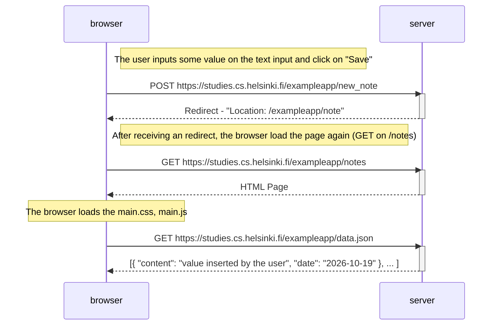

# Part0
### 0.4: New note diagram
Assuming that the page is already loaded.

```mermaid
sequenceDiagram
    participant browser
    participant server

    Note right of browser: The user inputs some value on the text input and click on "Save"

    browser->>server: POST https://studies.cs.helsinki.fi/exampleapp/new_note
    activate server
    server-->>browser: Redirect - "Location: /exampleapp/note"
    deactivate server
    
    Note right of browser: After receiving an redirect, the browser load the page again (GET on /notes)

    browser->>server: GET https://studies.cs.helsinki.fi/exampleapp/notes
    activate server
    server-->>browser: HTML Page
    deactivate server

    Note over browser: The browser loads the main.css, main.js

    browser->>server: GET https://studies.cs.helsinki.fi/exampleapp/data.json
    activate server
    server-->>browser: [{ "content": "value inserted by the user", "date": "2026-10-19" }, ... ]
    deactivate server
```