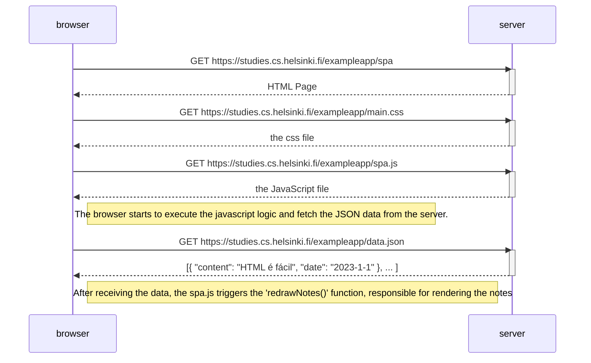

# Part0
### 0.5: Single page app diagram
Loading the single page app.

```mermaid
sequenceDiagram
    participant browser
    participant server

    browser->>server: GET https://studies.cs.helsinki.fi/exampleapp/spa
    activate server
    server-->>browser: HTML Page
    deactivate server

    browser->>server: GET https://studies.cs.helsinki.fi/exampleapp/main.css
    activate server
    server-->>browser: the css file
    deactivate server

    browser->>server: GET https://studies.cs.helsinki.fi/exampleapp/spa.js
    activate server
    server-->>browser: the JavaScript file
    deactivate server

    Note right of browser: The browser starts to execute the javascript logic and fetch the JSON data from the server.

    browser->>server: GET https://studies.cs.helsinki.fi/exampleapp/data.json
    activate server
    server-->>browser: [{ "content": "HTML é fácil", "date": "2023-1-1" }, ... ]
    deactivate server

    Note right of browser: After receiving the data, the spa.js triggers the 'redrawNotes()' function, responsible for rendering the notes
```