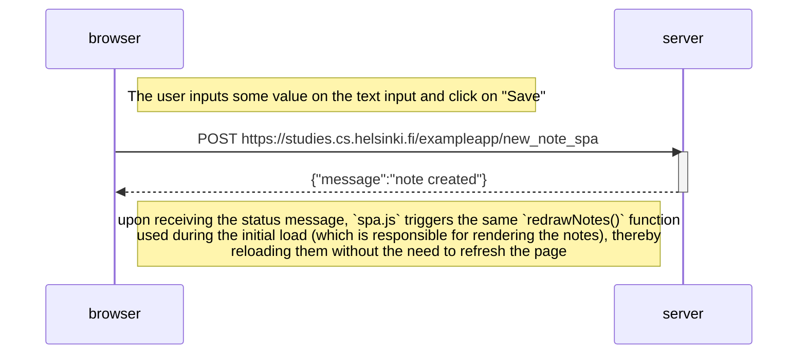

# Part0
### 0.6: New note in Single page app diagram
Assuming that the page is already loaded.

```mermaid
sequenceDiagram
    participant browser
    participant server
    
    Note right of browser: The user inputs some value on the text input and click on "Save"

    browser->>server: POST https://studies.cs.helsinki.fi/exampleapp/new_note_spa
    activate server
    server-->>browser: {"message":"note created"}
    deactivate server

    Note right of browser: upon receiving the status message, `spa.js` triggers the same `redrawNotes()` function<br> used during the initial load (which is responsible for rendering the notes), thereby<br> reloading them without the need to refresh the page 
```